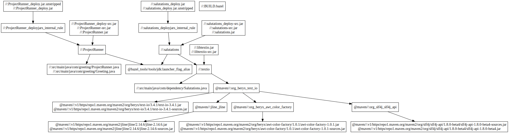

### Notes can be found [here](https://quip.com/U7rcAwFLIRxH/Bazel-Fundamentals).

---

### Running
```
bazel --version   # bazel 7.0.1
```
#### C++ Project
```
cd cpp-project
bazel run //greeting:helloworld
```

#### Java Project
```
cd java-project
bazel run //:ProjectRunner
bazel run //:salutations
bazel run //:restclient
```

Queries:
```
cd java-project
bazel run //:runner
bazel query //src/main/java/com/query/dishes/...
bazel query --noimplicit_deps "deps(:runner)"
bazel query "rdeps(//... , //src/main/java/com/query/ingredients:salt)"
bazel query 'attr(tags, "hcp", //src/main/java/com/query/customers/...)'
```

#### Python3 Project
```
cd py-project/app
bazel run //app:main
```

#### Rules
Gen Rules
```
cd rules/gen-rules
bazel build //:concat         # See output (target) in bazel-bin/concat.txt
bazel  build //:process_data  # See output (target) in bazel-bin/output.txt
bazel  build //:copy_files    # See output (target) in bazel-bin/copy_file.txt
bazel build //:cat_files      # See output (target) in bazel-bin/cat_files.txt
```

Custom Rules <br/>
`name` in `BUILD` is the target
```
cd rules/custom-rules
bazel build //:bin1                # See output (target) in bazel-bin/bin1
bazel build //:bin2                # See output (target) in bazel-bin/bin2
bazel build //:bin                 # See output (target) in bazel-bin/bin
bazel run //:say_hello_to_gaurav   # This is equivalent to bazel build //:hello-gaurav; bazel run //:say_hello_to_gaurav
```

### Visualize dependencies
```
bazel query  --notool_deps --noimplicit_deps "deps(//:*)" --output graph
```

Sample <a href="https://dreampuf.github.io/GraphvizOnline/#digraph%20mygraph%20%7B%0A%20%20node%20%5Bshape%3Dbox%5D%3B%0A%20%20%22%2F%2F%3AProjectRunner_deploy.jar.unstripped%5Cn%2F%2F%3AProjectRunner_deploy.jar%22%0A%20%20%22%2F%2F%3AProjectRunner_deploy.jar.unstripped%5Cn%2F%2F%3AProjectRunner_deploy.jar%22%20-%3E%20%22%2F%2F%3AProjectRunner_deployjars_internal_rule%22%0A%20%20%22%2F%2F%3AProjectRunner_deploy-src.jar%5Cn%2F%2F%3AProjectRunner-src.jar%5Cn%2F%2F%3AProjectRunner.jar%22%0A%20%20%22%2F%2F%3AProjectRunner_deploy-src.jar%5Cn%2F%2F%3AProjectRunner-src.jar%5Cn%2F%2F%3AProjectRunner.jar%22%20-%3E%20%22%2F%2F%3AProjectRunner%22%0A%20%20%22%2F%2F%3Asalutations_deploy.jar%5Cn%2F%2F%3Asalutations_deploy.jar.unstripped%22%0A%20%20%22%2F%2F%3Asalutations_deploy.jar%5Cn%2F%2F%3Asalutations_deploy.jar.unstripped%22%20-%3E%20%22%2F%2F%3Asalutations_deployjars_internal_rule%22%0A%20%20%22%2F%2F%3Alibtextio.jar%5Cn%2F%2F%3Alibtextio-src.jar%22%0A%20%20%22%2F%2F%3Alibtextio.jar%5Cn%2F%2F%3Alibtextio-src.jar%22%20-%3E%20%22%2F%2F%3Atextio%22%0A%20%20%22%2F%2F%3Asalutations_deployjars_internal_rule%22%0A%20%20%22%2F%2F%3Asalutations_deployjars_internal_rule%22%20-%3E%20%22%2F%2F%3Asalutations%22%0A%20%20%22%2F%2F%3Asalutations_deploy-src.jar%5Cn%2F%2F%3Asalutations-src.jar%5Cn%2F%2F%3Asalutations.jar%22%0A%20%20%22%2F%2F%3Asalutations_deploy-src.jar%5Cn%2F%2F%3Asalutations-src.jar%5Cn%2F%2F%3Asalutations.jar%22%20-%3E%20%22%2F%2F%3Asalutations%22%0A%20%20%22%2F%2F%3Asalutations%22%0A%20%20%22%2F%2F%3Asalutations%22%20-%3E%20%22%2F%2F%3Atextio%22%0A%20%20%22%2F%2F%3Asalutations%22%20-%3E%20%22%40bazel_tools%2F%2Ftools%2Fjdk%3Alauncher_flag_alias%22%0A%20%20%22%2F%2F%3Atextio%22%0A%20%20%22%2F%2F%3Atextio%22%20-%3E%20%22%2F%2F%3Asrc%2Fmain%2Fjava%2Fcom%2Fdependency%2FSalutations.java%22%0A%20%20%22%2F%2F%3Atextio%22%20-%3E%20%22%40maven%2F%2F%3Aorg_beryx_text_io%22%0A%20%20%22%2F%2F%3Asrc%2Fmain%2Fjava%2Fcom%2Fdependency%2FSalutations.java%22%0A%20%20%22%40maven%2F%2F%3Aorg_beryx_text_io%22%0A%20%20%22%40maven%2F%2F%3Aorg_beryx_text_io%22%20-%3E%20%22%40maven%2F%2F%3Av1%2Fhttps%2Frepo1.maven.org%2Fmaven2%2Forg%2Fberyx%2Ftext-io%2F3.4.1%2Ftext-io-3.4.1.jar%5Cn%40maven%2F%2F%3Av1%2Fhttps%2Frepo1.maven.org%2Fmaven2%2Forg%2Fberyx%2Ftext-io%2F3.4.1%2Ftext-io-3.4.1-sources.jar%22%0A%20%20%22%40maven%2F%2F%3Aorg_beryx_text_io%22%20-%3E%20%22%40maven%2F%2F%3Ajline_jline%22%0A%20%20%22%40maven%2F%2F%3Aorg_beryx_text_io%22%20-%3E%20%22%40maven%2F%2F%3Aorg_beryx_awt_color_factory%22%0A%20%20%22%40maven%2F%2F%3Aorg_beryx_text_io%22%20-%3E%20%22%40maven%2F%2F%3Aorg_slf4j_slf4j_api%22%0A%20%20%22%40maven%2F%2F%3Aorg_slf4j_slf4j_api%22%0A%20%20%22%40maven%2F%2F%3Aorg_slf4j_slf4j_api%22%20-%3E%20%22%40maven%2F%2F%3Av1%2Fhttps%2Frepo1.maven.org%2Fmaven2%2Forg%2Fslf4j%2Fslf4j-api%2F1.8.0-beta4%2Fslf4j-api-1.8.0-beta4-sources.jar%5Cn%40maven%2F%2F%3Av1%2Fhttps%2Frepo1.maven.org%2Fmaven2%2Forg%2Fslf4j%2Fslf4j-api%2F1.8.0-beta4%2Fslf4j-api-1.8.0-beta4.jar%22%0A%20%20%22%40maven%2F%2F%3Ajline_jline%22%0A%20%20%22%40maven%2F%2F%3Ajline_jline%22%20-%3E%20%22%40maven%2F%2F%3Av1%2Fhttps%2Frepo1.maven.org%2Fmaven2%2Fjline%2Fjline%2F2.14.6%2Fjline-2.14.6.jar%5Cn%40maven%2F%2F%3Av1%2Fhttps%2Frepo1.maven.org%2Fmaven2%2Fjline%2Fjline%2F2.14.6%2Fjline-2.14.6-sources.jar%22%0A%20%20%22%40maven%2F%2F%3Av1%2Fhttps%2Frepo1.maven.org%2Fmaven2%2Fjline%2Fjline%2F2.14.6%2Fjline-2.14.6.jar%5Cn%40maven%2F%2F%3Av1%2Fhttps%2Frepo1.maven.org%2Fmaven2%2Fjline%2Fjline%2F2.14.6%2Fjline-2.14.6-sources.jar%22%0A%20%20%22%40maven%2F%2F%3Av1%2Fhttps%2Frepo1.maven.org%2Fmaven2%2Forg%2Fberyx%2Ftext-io%2F3.4.1%2Ftext-io-3.4.1.jar%5Cn%40maven%2F%2F%3Av1%2Fhttps%2Frepo1.maven.org%2Fmaven2%2Forg%2Fberyx%2Ftext-io%2F3.4.1%2Ftext-io-3.4.1-sources.jar%22%0A%20%20%22%40maven%2F%2F%3Av1%2Fhttps%2Frepo1.maven.org%2Fmaven2%2Forg%2Fslf4j%2Fslf4j-api%2F1.8.0-beta4%2Fslf4j-api-1.8.0-beta4-sources.jar%5Cn%40maven%2F%2F%3Av1%2Fhttps%2Frepo1.maven.org%2Fmaven2%2Forg%2Fslf4j%2Fslf4j-api%2F1.8.0-beta4%2Fslf4j-api-1.8.0-beta4.jar%22%0A%20%20%22%2F%2F%3AProjectRunner_deployjars_internal_rule%22%0A%20%20%22%2F%2F%3AProjectRunner_deployjars_internal_rule%22%20-%3E%20%22%2F%2F%3AProjectRunner%22%0A%20%20%22%2F%2F%3AProjectRunner%22%0A%20%20%22%2F%2F%3AProjectRunner%22%20-%3E%20%22%2F%2F%3Asrc%2Fmain%2Fjava%2Fcom%2Fgreeting%2FProjectRunner.java%5Cn%2F%2F%3Asrc%2Fmain%2Fjava%2Fcom%2Fgreeting%2FGreeting.java%22%0A%20%20%22%2F%2F%3AProjectRunner%22%20-%3E%20%22%40bazel_tools%2F%2Ftools%2Fjdk%3Alauncher_flag_alias%22%0A%20%20%22%40bazel_tools%2F%2Ftools%2Fjdk%3Alauncher_flag_alias%22%0A%20%20%22%2F%2F%3Asrc%2Fmain%2Fjava%2Fcom%2Fgreeting%2FProjectRunner.java%5Cn%2F%2F%3Asrc%2Fmain%2Fjava%2Fcom%2Fgreeting%2FGreeting.java%22%0A%20%20%22%2F%2F%3ABUILD.bazel%22%0A%20%20%22%40maven%2F%2F%3Aorg_beryx_awt_color_factory%22%0A%20%20%22%40maven%2F%2F%3Aorg_beryx_awt_color_factory%22%20-%3E%20%22%40maven%2F%2F%3Av1%2Fhttps%2Frepo1.maven.org%2Fmaven2%2Forg%2Fberyx%2Fawt-color-factory%2F1.0.1%2Fawt-color-factory-1.0.1.jar%5Cn%40maven%2F%2F%3Av1%2Fhttps%2Frepo1.maven.org%2Fmaven2%2Forg%2Fberyx%2Fawt-color-factory%2F1.0.1%2Fawt-color-factory-1.0.1-sources.jar%22%0A%20%20%22%40maven%2F%2F%3Av1%2Fhttps%2Frepo1.maven.org%2Fmaven2%2Forg%2Fberyx%2Fawt-color-factory%2F1.0.1%2Fawt-color-factory-1.0.1.jar%5Cn%40maven%2F%2F%3Av1%2Fhttps%2Frepo1.maven.org%2Fmaven2%2Forg%2Fberyx%2Fawt-color-factory%2F1.0.1%2Fawt-color-factory-1.0.1-sources.jar%22%0A%7D">here</a>


